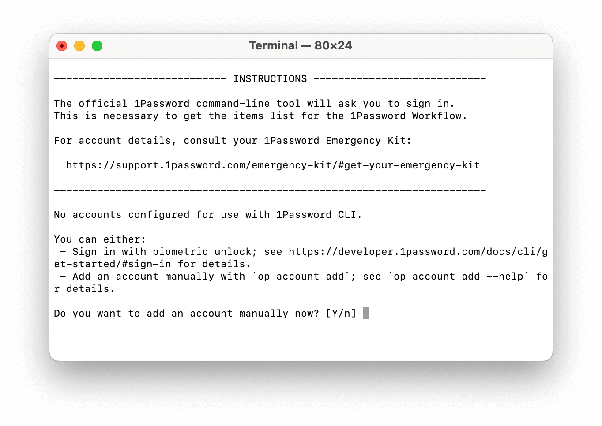

#  1Password Alfred Workflow

Search and open 1Password items

<a href='https://github.com/alfredapp/1password-workflow/releases/latest/download/1Password.alfredworkflow'>⤓ Download Workflow</a>

> On Alfred 4 use <a href='https://github.com/alfredapp/1password-workflow/releases/download/2022.13/1Password.alfredworkflow'>alternative link</a>

## About

This Workflow is for 1Password 8. For older versions, see Alfred Preferences → Features → 1Password.

Use `1p` to interact with your 1Password items.

On first run you’ll need to set up your account with 1Password’s official command-line tool. Your terminal will open and guide you through the process.

From then on, `1p` will show your items. ↩ opens the website in your browser (and fills the credentials if you have the browser extension installed) while ⌘↩ opens the item in 1Password.

Uncommon but useful actions, such as toggling vaults, can be accessed via `:1pextras`.

To report a problem, run `!1pdiagnostic`.

<a href='https://github.com/alfredapp/1password-workflow/releases/latest/download/1Password.alfredworkflow'>⤓ Download Workflow</a>

> On Alfred 4 use <a href='https://github.com/alfredapp/1password-workflow/releases/download/2022.13/1Password.alfredworkflow'>alternative link</a>
