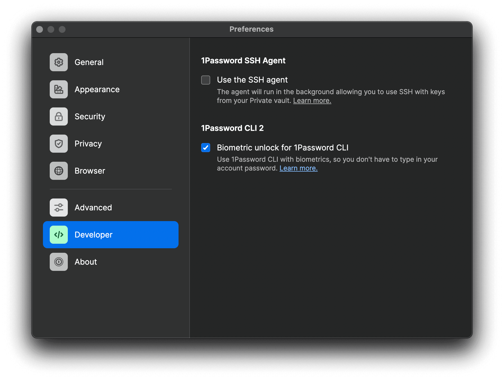
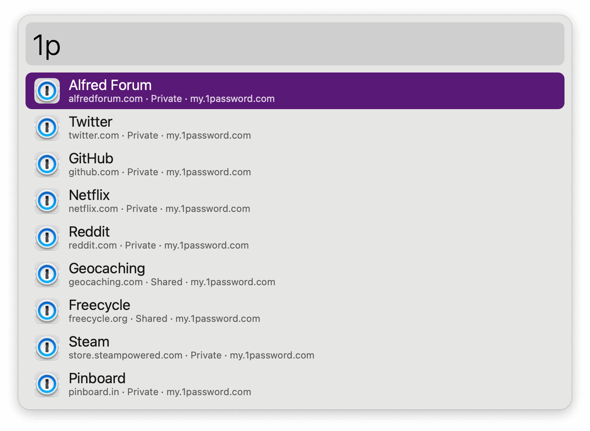
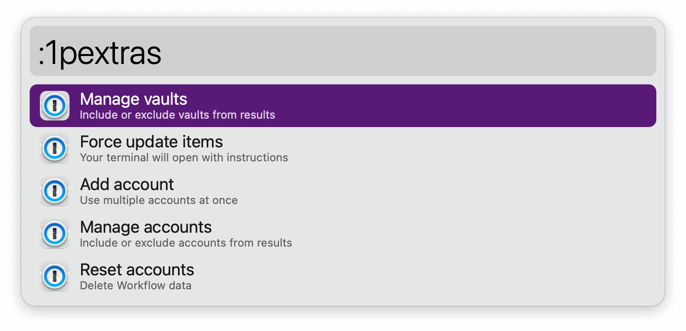
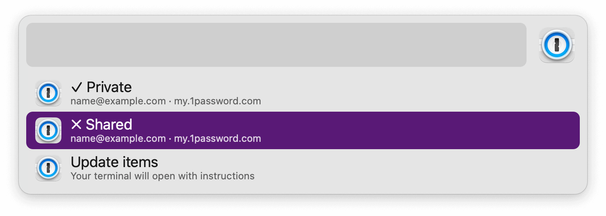

#  1Password Alfred Workflow

Search and open 1Password items

[⤓ Install on the Alfred Gallery](https://alfred.app/workflows/alfredapp/1password)

## Setup

[Install the 1Password CLI](https://1password.com/downloads/command-line/) and turn on the integration in 1Password Preferences → Developer → Connect with 1Password CLI.

## Usage

Interact with your 1Password items via the `1p` keyword.

* <kbd>↩&#xFE0E;</kbd>: Open and Fill.
* <kbd>⌘</kbd><kbd>↩&#xFE0E;</kbd>: View in 1Password.
* <kbd>⌥</kbd><kbd>↩&#xFE0E;</kbd>: Copy Password.
* <kbd>⌃</kbd><kbd>↩&#xFE0E;</kbd>: Copy Username.
* <kbd>⇧</kbd><kbd>↩&#xFE0E;</kbd>: Copy One-Time Password

Uncommon but useful actions, such as toggling vaults, can be accessed with `:1pextras`.

A [Fallback Search](https://www.alfredapp.com/help/features/default-results/fallback-searches/) is included.

To report a problem, run `!1pdiagnostic`.
